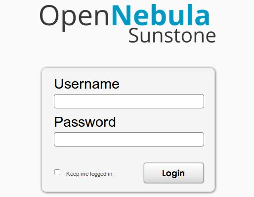

# module2 - OpenNebula : private cloud
Creating my own module using saltstack

The purpose of the following exercise(h6) is stated in the course bio:
http://terokarvinen.com/2018/aikataulu-%e2%80%93-palvelinten-hallinta-ict4tn022-4-ti-5-ke-5-loppukevat-2018-5p

-----------------------------------------------------

found in: https://www.supportsages.com/opennebula-iaas-cloud-installation-on-ubuntu/

## OpenNebula

The original purpose was to make a module about OwnCloud, but it proved to be more complexed that I had thougt and so after couple of days desided to change the subject.

The module is not fully active - I had some trouble with root - rights,
because the OpenNebula installation required root -rights to add the apt-key
to access the opennebula -package..

>> used "su -" to access the root and "su - ubuntu" to go back to normal user on run.sh

This worked fine while installing "by-hand" so tried using it for saltstack as well

-----------------------------------------------------
### Working with.
at the moment "working" with:

	git clone https://github.com/laurarajala/module2.git
	cd module2/
	bash run.sh

-----------------------------------------------------

### By-hand installation:
The original instructions that I used when intalling "by-hand":

>> ignored network-config

	wget -q -O- http://downloads.opennebula.org/repo/Ubuntu/repo.key | apt-key add&lt;strong&gt; -&lt;/strong&gt;
	echo "deb http://downloads.opennebula.org /repo/Ubuntu/12.04 stable opennebula" &gt; /etc/apt/sources.list.d /opennebula.list

>> to make the OpenNebula packages seen/available

	apt-get update
	apt-get install opennebula opennebula-sunstone opennebula-node bridge-utils

>> ignored the config

>> ignored the user/group/dynamic_ownership configs

	hostname -I

>> tried accessing port 9869

	http://localhost:9869/login

default password is: oneadmin
default password is found in: cat /var/lib/one/.one/one_auth

>> Randomly generated on every new installation

-------------------------------------------------------------
### run.sh file:

	#!bin/bash/

	su -
	echo "Changed to root..."
	
	echo "downloading OpenNebula packages..."
	echo "apt-get update"
	echo "Installing OpenNebula: opennebula -sunstone -node and bridge-utils"
	
	'./highstate.sh'
	
	echo "ignoring config changes..."
	echo "ignoring user/group/dynamic_ownership configs..."
	
	su - ubuntu
	echo "Changed back to user: ubuntu"
	
	
	echo "Use the following ipaddr to check your new cloud in the form: <ip-address>:9869"
	hostname -I
	
	echo "Your username and password are as follows"
	sudo cat /var/lib/one/.one/one_auth

### init.sls file:

	/etc/apt/sources.list.d/opennebula.list:
	  file.managed:
	    - source: salt://nebula/list.txt
	
	opennebula1:
	  cmd.run:
	    - name: wget -qO - http://downloads.opennebula.org/repo/Ubuntu/repo.key
	
	apt-key1:
	  cmd.run:
	    - name: sudo apt-key add -
	
	#Not working properly(!)
	
	opennebula2:
	   cmd.run:
	    - name: sudo apt-get update
	
	programs:
	  pkg.installed:
	    - pkgs:
	      - opennebula
	      - opennebula-sunstone
	      - opennebula-node
	      - brigde-utils

------------------------------------------------------------

